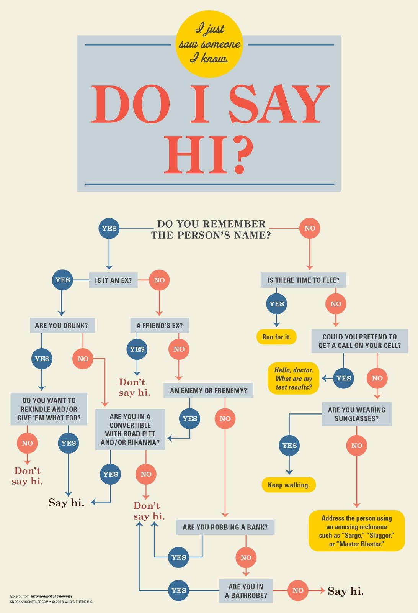

# Exercises 🏋️‍♂️

Here are the exercises for the Python Basics module. These exercises are designed to test your understanding of the concepts covered in the module. You can use the exercises to practice and improve your Python skills.

**Covered Topics:**

- Conditional Statements
- Branching 

## Exercise 1: Older Person - Easy 😊 (Est. Time: 5-10 mins | Points: 10)

**Problem:** Write a program that takes two integers as input - the age of `Alex` and the age of `Tatyana`. The program should output a message about who is older among them.

### Input:
- Two integers representing the ages of `Alex` and `Tatyana`.

### Output:
- A string message indicating who is older.

### Examples:

| No. | Inputs | Outputs |
| --- | ------ | ------- |
| 1   | 17 22  | Tatyana is the eldest. |
| 2   | 25 25  | Alex and Tatyana are of the same age. |
| 3   | 30 28  | Alex is the eldest. |

### Note:
The problem tests the ability to compare two numbers and output a corresponding message.

### Note:
The problem tests the ability to manipulate and process individual digits of a number.


## Exercise 2: Age Group Classification - Easy 😊 (Est. Time: 10-15 mins | Points: 20)

**Problem:** Write a program that asks the user to enter a person's age (an integer). The program should output a message about whether the person is an infant, a child, a teenager, or an adult according to the following rules: 
- if the person is `1` year old or less, he or she is an infant, 
- if the person is older than `1` year but younger than `13` years, they are a child, 
- if the person is not younger than `13` years but younger than `20` years, they are a teenager 
- and if the person is older than `20` years, they are an adult.

### Input:
- An integer representing the age of the person.

### Output:
- A string message indicating the age group of the person.

### Examples:

| No. | Inputs | Outputs               |
| --- | ------ | --------------------- |
| 1   | 3      | You are a child.      |
| 2   | 14     | You are a teenager.   |
| 3   | 25     | You are an adult.     |

### Note:
The problem tests the ability to use conditional statements to classify an input into one of several categories.

## Exercise 3: Roulette Color Prediction - Medium 🔥 (Est. Time: 15-20 mins | Points: 30)

**Problem:** The roulette game field is divided into numbers from `0` to `36`, which are black, red, or green. 
- Number `0` is green, 
- for numbers from `1` to `10`, odd numbers are red, and even numbers are black. 
- Odd numbers from `11` to `18` are black, and even numbers are red. 
- Odd numbers from `19` to `28` are red, and even numbers are black. 
- Odd numbers from `29` to `36` are black, and even numbers are red. 

Write a program that receives a number (a number from `0` to `36`) and shows whether the number is green, red, or black. The program should consider the option if the user enters a number that is outside the range from `0` to `36`.

### Input:
- An integer representing the number on the roulette wheel.

### Output:
- A string message indicating the color of the number or a message indicating that the bet will not play.

### Examples:

| No. | Inputs | Outputs |
| --- | ------ | ------- |
| 1   | 24     | Black   |
| 2   | 34     | Red     |
| 3   | 0      | Green   |
| 4   | 37     | The bet will not play! |

### Note:
The problem tests the ability to use conditional statements to classify an input into one of several categories.

## Exercise 4: School Grade Levels - Easy 😊 (Est. Time: 10-15 mins | Points: 20)

**Problem:** Write a program to output the text version of school grades: `1, 2, 3` (initial level), `4, 5, 6` (average level), `7, 8, 9` (sufficient level), `10, 11, 12` (high level). If the grade is outside the range `1` to `12`, the program should output "level is absent".

### Input:
- An integer representing the school grade.

### Output:
- A string message indicating the level of the grade or a message indicating that the level is absent.

### Examples:

| No. | Inputs | Outputs |
| --- | ------ | ------- |
| 1   | 7      | sufficient level |
| 2   | 10     | high level |
| 3   | 15     | level is absent |

### Note:
The problem tests the ability to use conditional statements to classify an input into one of several categories.

## Exercise 5: Quadratic Equation Roots - Medium 🔥 (Est. Time: 15-20 mins | Points: 30)

**Problem:** Write a program to find the roots of a quadratic equation `a*x^2 + b*x + c = 0`. The user enters the values of the coefficients `a`, `b`, `c`. The program should output the roots of the equation or a message indicating that there are no roots.

### Input:
- Three floating point numbers representing the coefficients `a`, `b`, `c` of the quadratic equation.

### Output:
- A string message indicating the roots of the equation or a message indicating that there are no roots.

### Examples:

| No. | Inputs | Outputs |
| --- | ------ | ------- |
| 1   | 8<br>4<br>2  | No roots. |
| 2   | 3.6<br>10<br>-3 | 0.27 and -3.05 |
| 3   | 2<br>4<br>2  | -1.00 |
| 4   | 1<br>2<br>3  | No roots. |
| 5   | 0<br>0<br>0  | Infinite roots. |

### Note:
The problem tests the ability to solve a quadratic equation and handle different cases of discriminant values.

## Exercise 6: Distance from Origin - Easy 😊 (Est. Time: 10-15 mins | Points: 20)

**Problem:** Given two points: `A (x1, y1)` and `B (x2, y2)`. Write a program that `determines` which of the points is `further from the origin`.

### Input:
- `Four integers` representing the coordinates of points A and B.

### Output:
- A string message indicating `which point is further from the origin` or a message indicating that the `distances are the same`.


### Examples:

| No. | Inputs | Outputs |
| --- | ------ | ------- |
| 1   | 1<br>2<br>3<br>4 | B is further from the origin. |
| 2   | 1<br>2<br>2<br>4 | A and B are at the same distance from the origin. |
| 3   | 1<br>2<br>0<br>0 | A is further from the origin. |

### Note:
The problem tests the ability to work with `geometric shapes` and `coordinate systems`.


## Exercise 7: Simple Calculator - Medium 🔥 (Est. Time: 15-20 mins | Points: 30)

**Problem:** Write a `simple calculator program` that reads three lines entered by the user: the `first number`, the `second number`, and the `arithmetic operation`, then applies the entered operation to the entered numbers and outputs the result. The calculator should support such arithmetic operations as: `+`, `-`, `/`, `*`, `mod` (remainder of division), `pow` (exponentiation), `div` (integer division). If division is performed and the second number equals 0, the string `"Division by 0!"` should be output. The entered numbers are `real`.

### Input:
- `Two floating point numbers` representing the operands.
- A `string` representing the operation.

### Output:
- A string message indicating the `result of the operation` or a message indicating that `division by zero` is attempted.


### Examples:

| No. | Inputs | Outputs |
| --- | ------ | ------- |
| 1   | 2.0<br>3.0<br>pow | 8.0 |
| 2   | 2.0<br>0.0<br>/   | Division by 0! |
| 3   | 5.0<br>3.0<br>%   | 2.0 |

### Note:
The problem tests the ability to implement a `simple calculator` that can handle different `arithmetic operations`.


## Exercise 8: Digit in Number - Easy 😊 (Est. Time: 10-15 mins | Points: 20)

**Problem:** Write a program in which a three-digit integer and a digit are entered. It is necessary to determine whether the entered digit is in the number.

### Input:
- An integer representing the three-digit number.
- An integer representing the digit.

### Output:
- A boolean indicating whether the digit is in the number.

### Examples:

| No. | Inputs | Outputs |
| --- | ------ | ------- |
| 1   | 125 2 | True |
| 2   | 543 1 | False |
| 3   | 123 3 | True |

### Note:
The problem tests the ability to work with digits of a number.

## Exercise 9: Compare Digits - Easy 😊 (Est. Time: 10-15 mins | Points: 20)

**Problem:** Given a `three-digit integer`. Determine the `sum of the first and last digits` of the number and `compare` it with the `value of the second digit` of the number. Accordingly, output the message: `>`, `<` and `=`.

### Input:
- An `integer` representing the three-digit number.

### Output:
- A `string` indicating the comparison result.

### Examples:

| No. | Inputs | Outputs |
| --- | ------ | ------- |
| 1   | 122 | > |
| 2   | 121 | = |
| 3   | 263 | < |

### Note:
The problem tests the ability to work with digits of a number and compare their values.


## Exercise 10: Right-Angled Triangle - Medium 😐 (Est. Time: 15-20 mins | Points: 30)

**Problem:** A triangle on a coordinate plane is given by integer coordinates of its vertices, which do not lie on the same line. The user enters the coordinates of the three vertices of the triangle (three pairs of numbers), and the program, accordingly, should output Yes or No to the question of whether the triangle is right-angled.

### Input:
- Six integers representing the coordinates of the vertices of the triangle.

### Output:
- A string message indicating whether the triangle is right-angled.

### Examples:

| No. | Inputs | Outputs |
| --- | ------ | ------- |
| 1   | 1<br>1<br>1<br>4<br>4<br>1 | Yes |
| 2   | 1<br>1<br>1<br>4<br>4<br>4 | No |
| 3   | 1<br>1<br>4<br>1<br>4<br>4 | No |

### Note:
The problem tests the ability to `work with digits` of a number and `compare` their values.

## Exercise 11: Leap Year - Easy 😊 (Est. Time: 10-15 mins | Points: 20)

**Problem:** It is necessary to `determine` whether a given year is a `leap year`. Recall that leap years are those years whose ordinal number is either a `multiple of 4`, but at the same time `not a multiple of 100`, or a `multiple of 400` (for example, the year 2000 was a leap year, and the year 2100 will be a common year). The program should work correctly for numbers `1900 ≤ n ≤ 3000`. Print `"Leap year."` if the year is a leap year, and `"Ordinary year."` otherwise.

### Input:
- An `integer` representing the year.

### Output:
- A `string` message indicating whether the year is a leap year.

### Examples:

| No. | Inputs | Outputs |
| --- | ------ | ------- |
| 1   | 2001 | Ordinary year. |
| 2   | 2019 | Ordinary year. |
| 3   | 2020 | Leap year. |

### Note:
The problem tests the ability to work with dates and calendar calculations.

## Exercise 12: Replace Even Digits - Easy 😊 (Est. Time: 10-15 mins | Points: 20)

**Problem:** Given a `four-digit number`. `Replace` all `even digits` in the number with the symbol `*` and `output` the number.

### Input:
- An `integer` representing the four-digit number.

### Output:
- A `string` with all even digits replaced by `*`.

### Examples:

| No. | Inputs | Outputs |
| --- | ------ | ------- |
| 1   | 2358 | *35* |
| 2   | 2227 | ***7 |
| 3   | 1353 | 1353 |

### Note:
The problem tests the ability to `work with digits` of a number and `replace` certain values.

## Exercise 13: Different Digits - Easy 😊 (Est. Time: 10-15 mins | Points: 20)
**Problem:** Given a natural number `n` (`n ≤ 9999`). Determine whether `all four digits` of this number are `different` (considering four digits). For example, in the number `5623`, all digits are different, in the number `0012` - no.

### Input:
- An `integer` representing the four-digit number.

### Output:
- A `boolean` indicating whether all digits in the number are different.

### Examples:

| No. | Inputs | Outputs |
| --- | ------ | ------- |
| 1   | 1234 | True |
| 2   | 1981 | False |

### Note:
The problem tests the ability to `work with digits` of a number and `compare` their uniqueness.

## Exercise 14: Palindrome Number - Easy 😊 (Est. Time: 10-15 mins | Points: 20)
**Problem:** Given a `four-digit number`. Check if it is a `palindrome`. A palindrome is a number, word, or text that reads the same left to right and right to left. For example, in our case, palindrome numbers will be: `1221`, `4444`, `9119`, etc.

### Input:
- An `integer` representing the four-digit number.

### Output:
- A `boolean` indicating whether the number is a palindrome.

### Examples:

| No. | Inputs | Outputs |
| --- | ------ | ------- |
| 1   | 4556 | False |
| 2   | 8118 | True |
| 3   | 1221 | True |

### Note:
The problem tests the ability to `work with digits` of a number and `compare` their values.

## Exercise 15:  Next Day's Date - Medium 🔥 (Est. Time: 15-20 mins | Points: 30)
**Problem:** Write a program where the user enters the value of the current date: day, month, and year (whole numbers), and the program outputs the `next day's date` in the format: `dd.mm.yyyy`.

### Input:
- Three `integers` representing the day, month, and year.

### Output:
- A `string` representing the next day's date in the format `dd.mm.yyyy`.

### Examples:

| No. | Inputs | Outputs |
| --- | ------ | ------- |
| 1   | 28<br>2<br>2024 | 29.2.2024 |
| 2   | 31<br>12<br>2020 | 1.1.2021 |
| 3   | 1<br>1<br>2020 | 2.1.2020 |

### Note:
The problem tests the ability to work with dates and calendar calculations.

## Exercise 16: Previous Day's Date - Medium 🔥 (Est. Time: 15-20 mins | Points: 30)

**Problem:**Write a program where the user enters the value of the current date: day, month, and year (whole numbers), and the program outputs the `previous day's date` in the format: `dd.mm.yyyy`.

### Input:
- Three `integers` representing the day, month, and year.

### Output:
- A `string` representing the previous day's date in the format `dd.mm.yyyy`.

### Examples:

| No. | Inputs | Outputs |
| --- | ------ | ------- |
| 1   | 1<br>3<br>2024 | 29.2.2024 |
| 2   | 1<br>1<br>2020 | 31.12.2019 |
| 3   | 2<br>1<br>2020 | 1.1.2020 |


### Note:

The problem tests the ability to work with dates and calendar calculations.

## Exercise 17: Lucky Ticket - Medium 🔥 (Est. Time: 15-20 mins | Points: 30)

**Problem:** Tatiana loves to ride public transport, and when she gets a ticket, she immediately checks if it is `lucky`. A ticket is considered lucky if the `sum of the first three digits` matches the `sum of the last three digits` of the ticket number. Write a program that will check the equality of sums and output `Happy` if the sums match, and `Ordinary` if the sums are different. The program is given a string of `six digits`.

### Input:
- A `string` of six digits representing the ticket number.

### Output:
- A `string` that is either `Happy` if the sum of the first three digits equals the sum of the last three digits, or `Ordinary` if the sums are different.

### Examples:

| No. | Inputs | Outputs |
| --- | ------ | ------- |
| 1   | 156012 | Ordinary |
| 2   | 122005 | Happy |
| 3   | 045090 | Happy |

### Note:
The problem tests the ability to work with digits of a number and compare their values.

## Exercise 18: Greeting Decision - Hard 🥵 (Est. Time: 20-25 mins | Points: 50)

**Problem:** You just saw someone you know, and you need to decide whether to `say hi` or `not`. The decision depends on several factors, such as whether you remember the person's name, if they are an ex, if you are currently in an unusual situation (like robbing a bank), and others. Your program should simulate this decision-making process.

### Input:
- A series of `Yes` or `No` responses to the questions in the decision tree.

### Output:
- The final decisions: `Say hi`, `Don't say hi`, `Keep walking`, etc.

### Instructions:
Refer to the attached decision tree image to guide the user through the decision-making process.

### Hint: 
Try to make as less inputs as possible to reach the final decision.

### Examples:

| No. | Scenario                                                                      | Decision       |
| --- | ----------------------------------------------------------------------------- | -------------- |
| 1   | Remember the name: **Yes**<br> Is it an ex: **No** <br>Are you drunk: **No**                    | Say hi         |
| 2   | Remember the name: **No**<br> Is there time to flee: **Yes**                             | Run for it.    |
| 3   | Remember the name: **Yes**<br> Is it an ex: **Yes**, Are you drunk: **Yes**<br> Do you want to rekindle: **No** | Don't say hi   |

### Note:
This exercise is designed to help students understand and implement branching logic based on a provided decision tree. They will practice tracing paths through the decision tree based on input conditions to reach a conclusion.




# Problems in Order of Difficulty According to ChatGPT

The exercises provided range from understanding conditional statements to implementing complex branching logic. Here's a summary of the exercises ordered by difficulty, starting with the easiest and moving to more challenging problems.

## Easy 😊
1. **Exercise 1: Older Person** - Teaches basic comparison using conditional statements.
2. **Exercise 2: Age Group Classification** - Implements conditional logic to classify age groups.
3. **Exercise 4: School Grade Levels** - Uses conditionals to match school grades with their corresponding levels.
4. **Exercise 6: Distance from Origin** - Engages with geometric concepts and coordinate systems to determine distances.
5. **Exercise 8: Digit in Number** - Focuses on determining the presence of a digit within a number.
6. **Exercise 9: Compare Digits** - Compares the sum of specific digits against a single digit within a number.
7. **Exercise 11: Leap Year** - Applies rules to determine whether a year is a leap year or not.
8. **Exercise 12: Replace Even Digits** - Replaces even digits within a number using conditional checks.
9. **Exercise 13: Different Digits** - Tests for uniqueness among the digits of a number.
10. **Exercise 14: Palindrome Number** - Checks whether a number is a palindrome.

## Medium 🔥
1. **Exercise 3: Roulette Color Prediction** - Involves more complex conditions for determining roulette colors.
2. **Exercise 5: Quadratic Equation Roots** - Solves a quadratic equation, handling different discriminant cases.
3. **Exercise 7: Simple Calculator** - Implements a calculator that performs various arithmetic operations.
4. **Exercise 10: Right-Angled Triangle** - Determines if a triangle is right-angled using coordinates.
5. **Exercise 15: Next Day's Date** - Calculates the date of the following day.
6. **Exercise 16: Previous Day's Date** - Calculates the date of the previous day.
7. **Exercise 17: Lucky Ticket** - Uses digit manipulation to determine if a ticket number is lucky.

## Hard 🥵
1. **Exercise 18: Greeting Decision** - Tests complex branching logic with multiple decision paths, based on a decision tree.

Each exercise is designed to challenge different aspects of problem-solving, from simple arithmetic to complex logical reasoning. The estimated completion time for the exercises ranges from 5 minutes for the simplest tasks to 25 minutes for the most complex ones. This gives an average expected time of approximately 10-15 minutes per exercise, depending on the student's prior knowledge and experience.


# Checking Your Score with Autograder 📝

GitHub Classroom's autograder provides immediate feedback on your exercises. Each exercise is worth points based on its complexity, with a total of `90` points available across all exercises. 

When you commit and push your solution, GitHub Actions will run tests on your code. If all tests for an exercise pass, you will be awarded the full points for that exercise. If some tests fail, partial points may be awarded. 

The workflow will run all tests, even if some fail. The total score will be shown in the workflow output as `points scored/total points available`. For example, if you see `10/90`, it means you've successfully completed the first problem worth `10` points.

Please note that the workflow will show as failed if any test fails, even if you've successfully solved some problems. Look for the points tally in the output to see your score.

Remember, practice makes perfect! If you don't pass all tests the first time, review your code, make improvements, and try again. You can push new changes as many times as you need.

# Running Your Code and Tests Locally 🖥️

To run your code and tests locally, you can use the following commands:

1. Run the code:
```bash
python exercises/exercise_1.py
```

2. Run the tests:

To run the tests for an exercise, you'll use the pytest framework. First, make sure you have pytest installed: 

```bash
pip install pytest
```

Then, you can run the tests for a specific exercise using the following command:

```bash
python -m unittest tests/test_exercise_1.py
```

And for more beautiful output, you can use:

```bash
pytest --color=yes -vv tests/test_exercise_1.py
```

or to run only failed test from a specific file:

```bash
pytest --color=yes --failed-first -x tests/test_exercise_1.py
```

Replace `exercise_1` with the exercise you're working on (e.g., `exercise_2`, `exercise_3`, etc.) and `test_exercise_1` with the corresponding test file.

